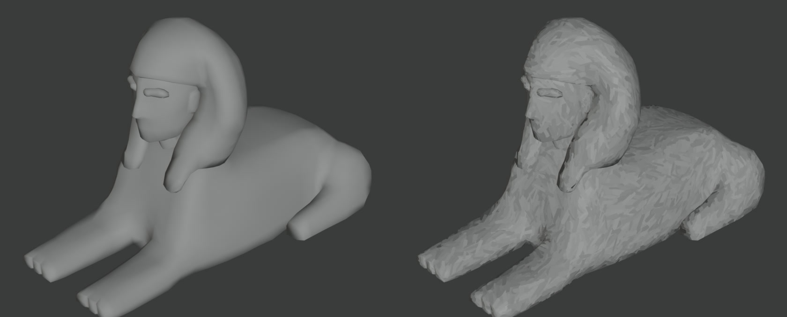

# AutoStroke

**A Blender add-on that paints any mesh in brush strokes that follow its form.** It bakes
the result into textures, with a real-time GPU preview while you tune it.


*Left: the mesh as modelled. Right: the same mesh after one bake: no hand painting, no
UV-seam artifacts.*

<!-- live preview GIF: record per docs/media/README.md, run tools/encode_media.sh, then
     uncomment:

-->

[Project page and walkthrough video](https://jss6088.github.io/projects/autostroke/autostroke.html) ·
[How the algorithm works](ALGORITHM.md) ·
Blender 5.0+ · GPL-3.0-or-later

## What it does

- **Places strokes on the surface itself, not in UV space.** A painterly filter run over
  a flattened UV layout paints every seam into the result. AutoStroke places strokes in 3D,
  sized to the faces they sit on and turned to run along the direction the surface bends
  least, eliminating presence of UV seams.
- **Bakes two maps.** A **stroke normal map** lights like painted relief. An
  **indirection map** records which stroke owns each texel, so any texture read through
  it paints one flat colour per stroke.
- **Builds the material for you**, and the live preview shows the same result the bake
  writes.

## Features

- **Stroke Count**: ask for a total, and per-face density is solved to hit it. Min/Max
  strokes per face.
- **Brush sets**: `standard` and `rough` built in, or point it at a folder of your own
  brush PNGs.
- **Look controls**: Stroke Size, Size Variation, Global Rotation, Rotation Jitter,
  Stroke Cutoff.
- **Crease guard**: strokes don't reach around sharp folds.
- **Batch bake**: select several objects and bake them all with the same settings. One
  failure doesn't stop the rest.
- **GPU bake by default**, with an automatic fallback to the CPU if there's no usable GPU
  or it misbehaves.
- **Live preview** in the viewport. No bake needed while you tune.

## Install

1. Download [`autostroke-0.13.1.zip`](autostroke-0.13.1.zip).
2. In Blender 5.0 or later: **Edit → Preferences → Get Extensions**, then the **▾** menu
   at the top right → **Install from Disk…**, and pick the zip.

## Quickstart

1. Select one or more meshes that have a UV map. Smart UV Project is fine.
2. In the 3D Viewport press **N** and open the **AutoStroke** tab.
3. Set **Stroke Count** and pick a **Brush Set**.
4. Turn on **Live Preview** and adjust until it looks right.
5. Press **BAKE**. The maps go to **Working Dir** (default `//AutoStroke/`, next to the
   saved `.blend`), and the strokes are added to every material on the object: each gets
   its own copy, so the originals stay untouched. **Remove Strokes** puts them back.

<!-- panel screenshot: docs/media/panel.png (see docs/media/README.md), then uncomment:

-->

## How it works

```
 mesh ──► 1. PLACEMENT ──────────► 2. TEXEL RESOLUTION ─────────► 3. OUTPUT
          where strokes sit,         which stroke owns             stroke normal map
          how big, which way         each texel                    + indirection map
          (per face, in 3D)          (GPU compute; CPU fallback)   + material
```

1. **Placement** ([ALGORITHM.md Part 1](ALGORITHM.md#part-1--placement)).
   - Each face gets strokes in proportion to its area. The density is solved so the total
     matches Stroke Count.
   - Within a face, positions come from longest-edge bisection, which is area-uniform,
     nested and shape-aware.
   - Each stroke is sized from the region it is responsible for. It points along the
     least-curved direction, from a fitted and smoothed curvature field.
2. **Texel resolution** ([Part 2](ALGORITHM.md#part-2--texel-resolution),
   [Part 3](ALGORITHM.md#part-3--the-gpu-search-preview-and-bake)).
   - Cycles bakes each texel's 3D position and normal.
   - Every texel then takes the **smallest** stroke whose brush shape covers it and whose
     normal agrees with the surface there.
   - A stroke only reaches surface it can travel to **across the mesh**, so it never
     jumps to a stacked layer, a floating part or the far side of a fold
     ([§2.10](ALGORITHM.md#210-reachable-surface)).
3. **Output.**
   - The winner's normal goes into the stroke normal map, and its UV pointer and tone into
     the indirection map.
   - Gaps are dilated. Every material on the object gets a copy with the stroke normal
     and per-stroke tone wired in; its own colour and roughness are kept.


## Future direction - detail normal map

- Artists often use a detail normal map for small-scale surface displacement, like pores,
  weave or carving. A second "surface detail" level of strokes would paint that relief
  too, on top of the form-level strokes.
- The design is written up in
  [docs/ideas/detail-normal-level.md](docs/ideas/detail-normal-level.md).

Details and the ideas that were tried and declined are in [ALGORITHM.md](ALGORITHM.md).

## Project layout

```
autostroke/
  core/          pure numpy: sampling, geometry, texel resolution (no bpy)
  bridge/        Blender-facing: mesh reading, Cycles position bake, seeds, caches
  ops/           operators: bake (modal, batch), material, readiness checks and estimate
  ui/            the sidebar panel
  shaders.py     the shared GLSL stroke search
  gpu_resolve.py the compute-shader bake
  livepreview.py the viewport preview and its operators
  tests/         the test suites
tools/           in-Blender checks and showcase/media scripts
docs/            showcase media and design notes
ALGORITHM.md     the full algorithm, with measurements
```

## License

GPL-3.0-or-later, as required for Blender add-ons. See [LICENSE](LICENSE).
